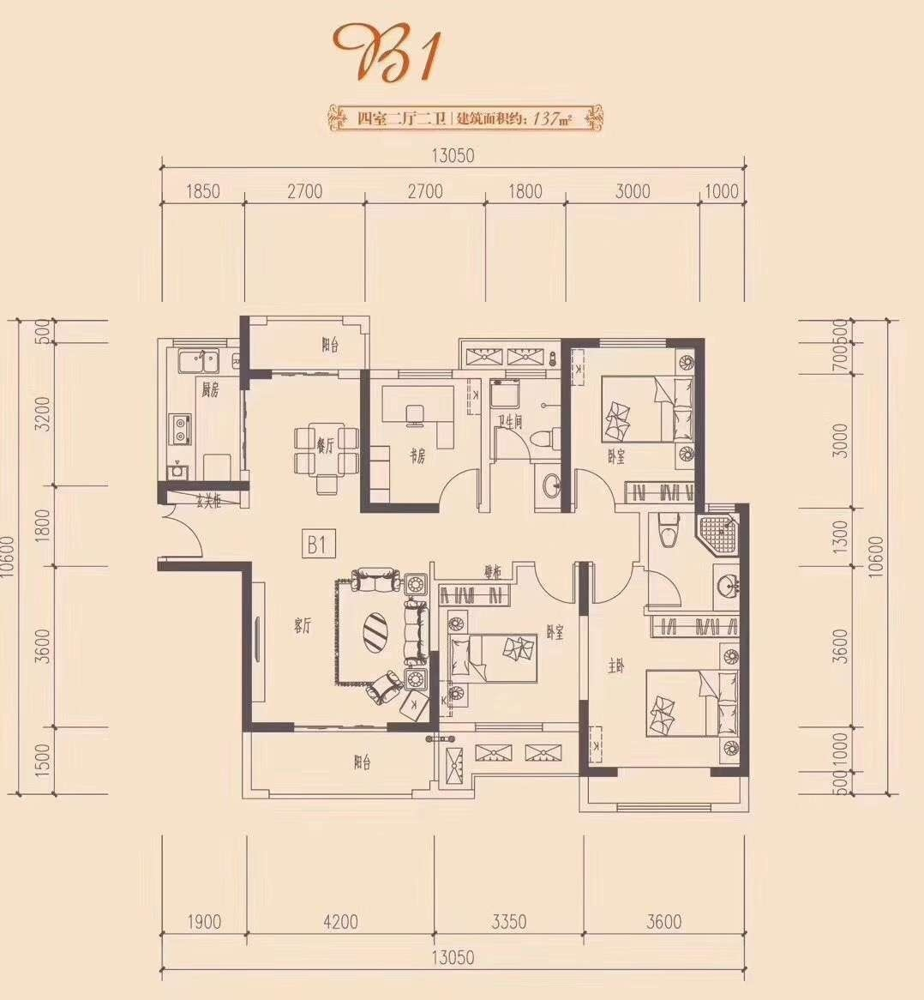
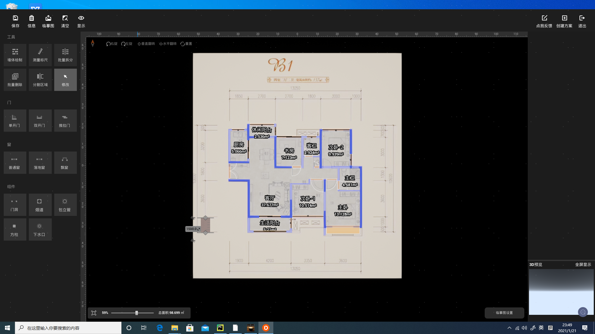
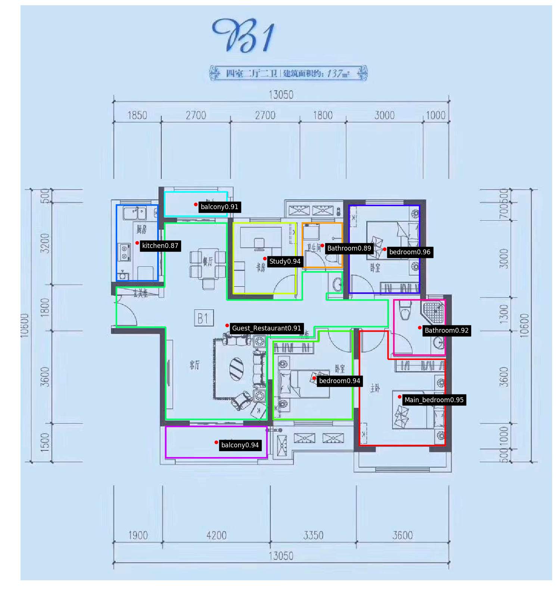
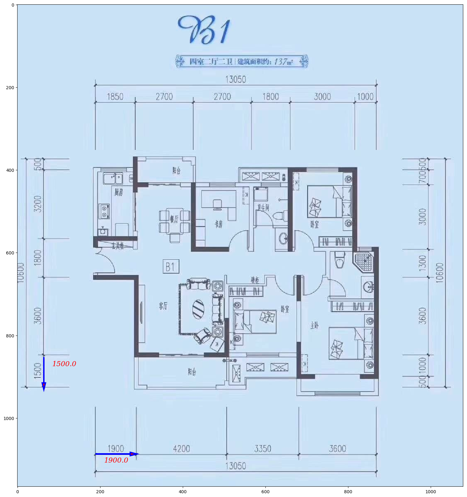
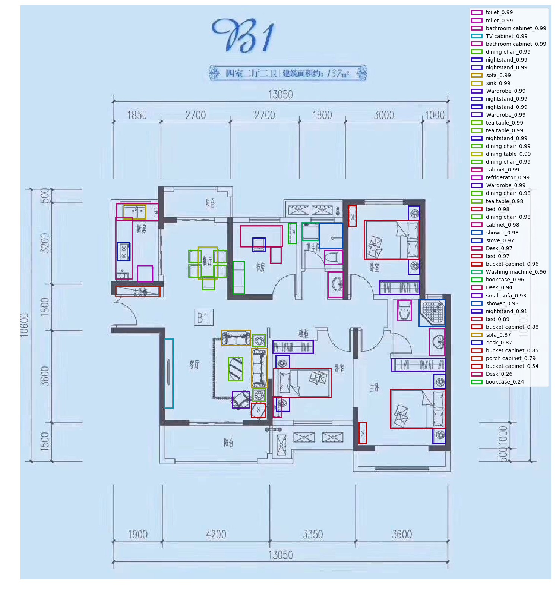
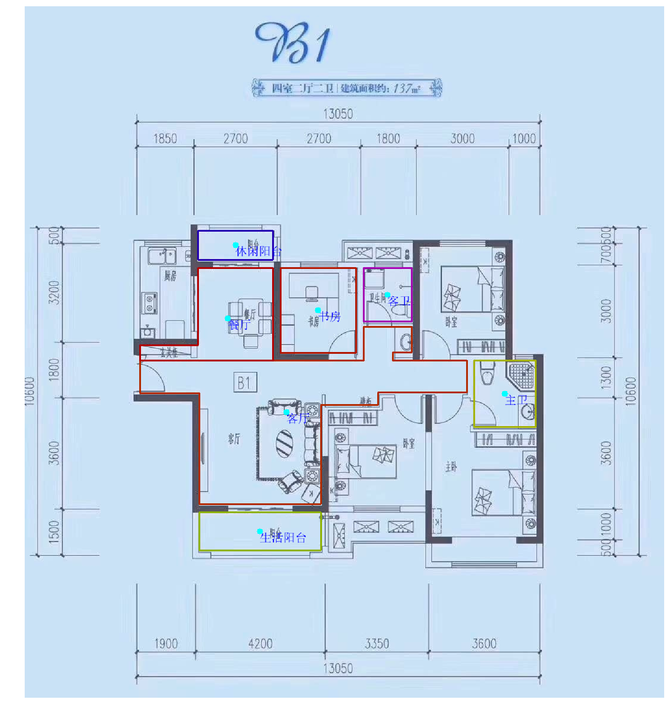
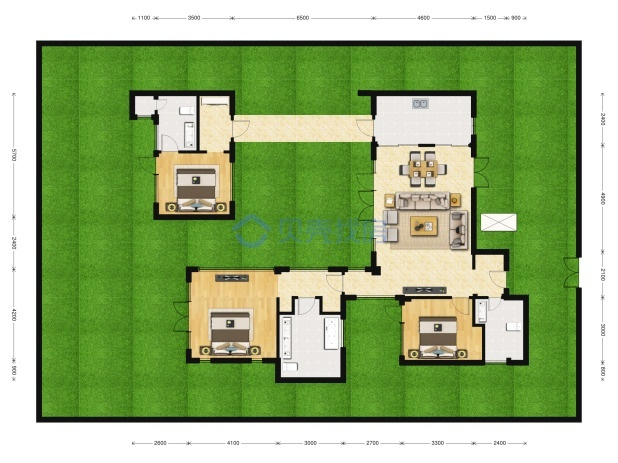
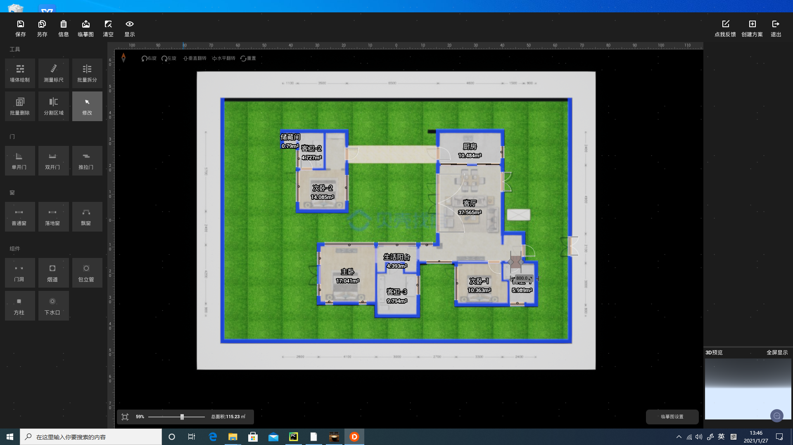
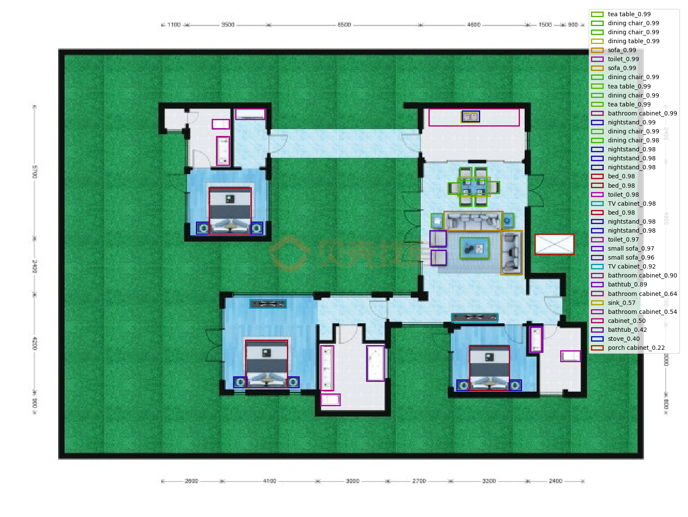
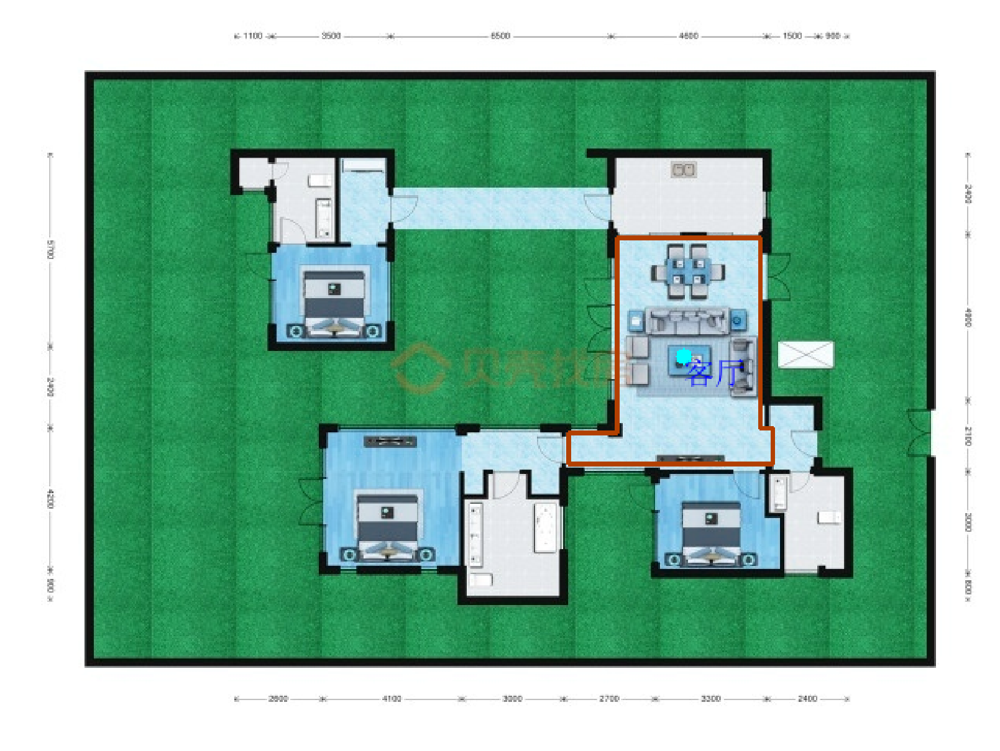

# Floor_plan_recognition 

```
This system contains several major modules: door, window and wall recognition, room recognition, furniture recognition, scale recognition, and result post-processing.
The entire project members and previous version updates were completed by me, He Yeyang, Zhu Hong, Zhang Luoyang, Luo Xiaojuan, and Di Xinhan. Several version updates took place.
```

## Commeercialization effect

Commercialized effect videos and some pictures are displayed on [this path](./Commercialization_effect), and users can easily import the floor plan of their own home to generate a 3D home.

Here are a few pictures showing the effect.

[video 1](./Commercialization_effect/南京市户型库-house_id_1029233住宅4室2厅1厨2卫2阳台.mp4)

[video 2](./Commercialization_effect/南京市户型库-house_id_1029233住宅4室2厅1厨2卫2阳台.mp4)

| Image_ori                                                    | Image_effect                                                 | room recognition                                             | scale recognition                                            | furniture recognition                                        | LivDinSplit                                                  |
| ------------------------------------------------------------ | ------------------------------------------------------------ | ------------------------------------------------------------ | ------------------------------------------------------------ | ------------------------------------------------------------ | ------------------------------------------------------------ |
|  |  |  |  |  |  |
|  |  |  |  |  |  |


Of course, there are some pictures that are not so ideal, you can view them in [this path](./Commercialization_effect/not_so_good/) and [this_path](./Commercialization_effect/not_so_good)